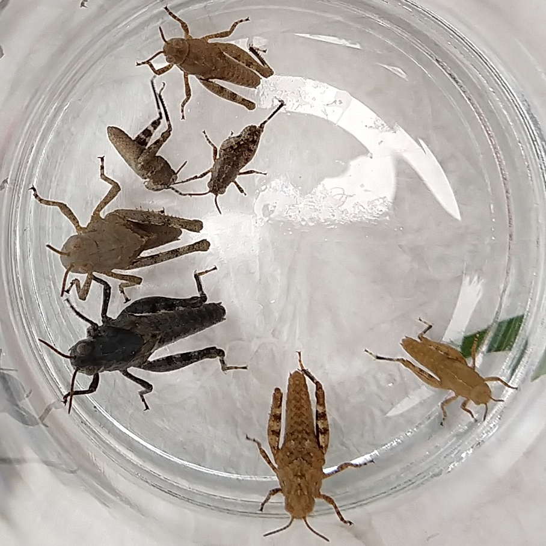

# Bugs

|Date      | Name      | Photo  | Notes|
---        | ---       | ---    | ---
|6-23-2021 | Tadpole |  | Jordan Pond, ME |
|6-23-2021 | Fish |  | Jordan Pond, ME |
|6-23-2021 | Moth |  | Bar Harbor, ME |
|6-23-2021 | Butterfly |  | Bar Harbor, ME |
|6-22-2021 | Grasshopper |  | Bar Harbor, ME |
|6-22-2021 | Daddy long legs |  | Bar Harbor, ME |
